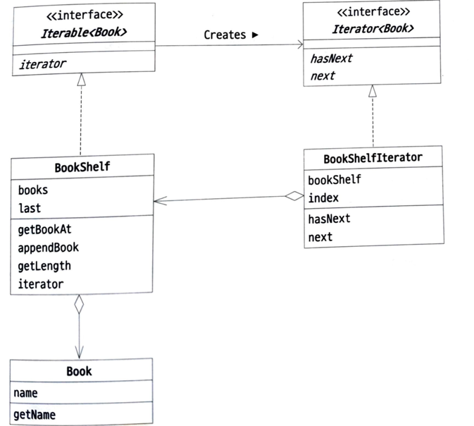
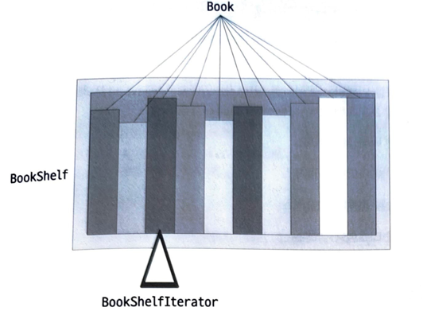

# Iterator 패턴

---
## 역할
- 반복자역: iterator -> BookShelfIterator
- 집합체역: iterable -> BookShelf

## 장점
- BookShelf의 어레이 타입을 ArrayList로 바꾸어도 영향을 끼치지 않는다
- 즉 각 객체의 핵심 로직에 영향을 끼치지 않고 Iterator 를 수행 가능
- 명시적 / for-each 모두 사용 가능

