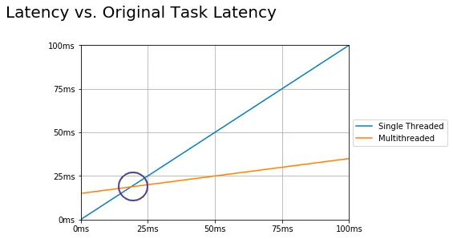
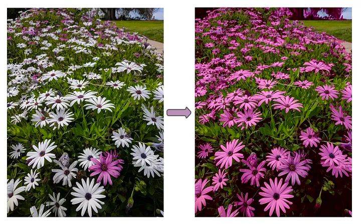

# Section 4
Latency: 작업을 완료할 떄가지의 시간 / Throughput: 시간당 처리량

- 코어의 수 와 Thread 수가 같다면 이상적인 것
- 요즘에 하이퍼스레드를 사용해서 하나의 코어가 병렬로 스레드 처리 가능
- 코어의 수 보다 쓰레드 수가 많아지면 비생상적

## Inherent cost of parallelization and aggregation
- 작업을 나누었던 비용
- 스레드 생성 및 스레드에 작업 전달 및 시작하는 비용
- 운영체제가 스케쥴링을 통해 스레드를 실행되기까지의 시간
- 마지막 스레드가 완료 후의 신호를 기다리는 시간
- 통합 스레드가 신호를 받아 재실행 될떄까지의 시간
- 하위 작업을 하나의 artifact 로 통합하는데의 비용
  - 스레드 풀링을 활용하면 위의 시간들을 없앨 수 있다.

- 출처 https://medium.com/@aysunfar/performance-optimizing-for-latency-part-i-93459bba237a

## 모든 작업을 다 나눌순 없다.
### 크게 3종류가 있다.
- 본질적으로 병행 가능하며 하위작업으로 쉽게 분할되는 작업
- 분할이 불가능 해 처음부터 끝까지 싱글스레드를 쓸 수 밖에 없는 작업
- 가장 흔한 케이스: 부분적으로 하위작업으로 나눌 수 있고, 순차적으로 수행하는 케이스

- 하나의 예시로 흰색 -> 보라색 이미지 변환 처리를 Thread 로 예를 두고 있다.
~~~ java
/**
  쓰레드 수를 명시
*/
int numberOfThreads = 2; // multi
recolorMultithreaded(originalImage, resultImage, numberOfThreads); // multi

/**
  ...
*/

/**
  쓰레드 수 만큼 이미지를 분할해서 쓰레드를 저장 후 각 스레드가 모두 수행되면 완료처리한다.
*/
public static void recolorMultithreaded(BufferedImage originalImage, BufferedImage resultImage, int numberOfThreads) {
        List<Thread> threads = new ArrayList<>();
        int width = originalImage.getWidth();
        int height = originalImage.getHeight() / numberOfThreads;

        for(int i = 0; i < numberOfThreads ; i++) {
            final int threadMultiplier = i;

            Thread thread = new Thread(() -> {
                int xOrigin = 0 ;
                int yOrigin = height * threadMultiplier;

                recolorImage(originalImage, resultImage, xOrigin, yOrigin, width, height);
            });

            threads.add(thread);
        }

        for(Thread thread : threads) {
            thread.start();
        }

        for(Thread thread : threads) {
            try {
                thread.join();
            } catch (InterruptedException e) {
            }
        }
    }
~~~

## Throughput
- 처치량: 주어진 기간에 완성되는 작업의 수
- 시간단위로 나워 처치량을 측정

### 부하테스트가 필요한 이유
~~~ text
하나의 머신에서 HTTP 서버가 실행되고 있습니다.
HTTP 요청을 처리하는 작업은 고정된 크기의 스레드 풀에 배정됩니다.
각 요청은 풀에 있는 단일 스레드가 외부 데이터베이스에 블로킹 호출 작업을 수행하는 방식으로 처리되며, 이 호출은 여러 변수에 따른 변수 주기를 가질 수 있습니다.
데이터베이스 측에서 응답이 온 후, 서버 스레드는 사용자에게 HTTP 응답을 전송합니다.
64개의 코어를 갖춘 머신이 있다고 가정해 보겠습니다.
HTTP 요청을 처리하는 데 최적인 스레드 풀 크기는 무엇일까요?

- 스레드가 “실행 중” 상태가 아니므로, 들어오는 요청을 처리하는 동안에는 모든 스레드가 계속 IO에서 블록된 상태일 수 있지만(데이터베이스 측의 응답을 기다리는 중), CPU는 실제로 어떤 작업도 실행하고 있지 않습니다. 
따라서 들어오는 요청을 처리할 스레드를 더 생성하면, 처리량이 더 많아집니다. 
스레드가 더 많다는 것은 더 많은 요청을 처리할 수 있다는 뜻이지만, 오버헤드와 컨텍스트 스위칭도 더 많아지기 때문에 최적의 스레드 개수를 미리 알 수 있는 방법은 없습니다. 
따라서 부하 테스트를 수행해야 하죠.
~~~

