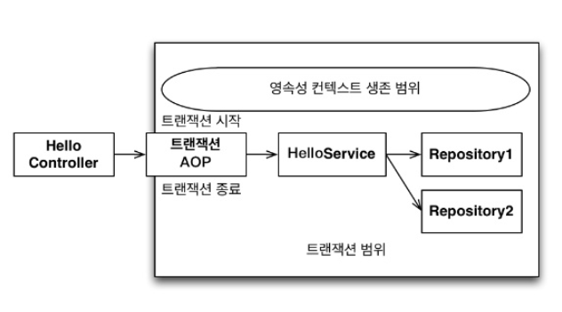

# Transaction

---
## Java 에서의  Transaction 
- Connection 객체를 통해 트랜잭션의 시작과 종료가 이루어짐
- 결과는 Commit or Rollback
- Transaction 하나의 Connection 을 사용하다가 닫는 사이에 발생
- JDBC의 default 는  auto commit
    - 트랜잭션을 처리하기 위해서는 auto-commit 을 false 로 해야 함
~~~java
    public void executeQuery() throws SQLException {
        Connection connection = dataSource.getConnection();
        connection.setAutoCommit(false);
        /**
            트랜잭션 시작
            ...
         */
        }
~~~ 
## Spring 에서의 Transaction
- 추상화된 트랜잭션 매니저를 이용
- auto-commit 등의 작업은 트랜잭션 매니저 내부에서 진행됨
~~~ java
public void executeQuery() throws SQLException {
    TransactionStatus status = transactionManager.getTransaction(new DefaultTransactionDefinition());
    /**
        트랜잭션 시작
        ...
    */
}
~~~
## 트랜잭션 종료
- 트랜잭션은 시작하면 commit()/rollback() 호출될 때 까지 하나의 트랜잭션이 됨
- 트랜잭션의 경계는 하나의 커넥션이 만들어지고 닫히는 범위안에 존재
~~~ java
public void executeQuery() throws SQLException {
    TransactionStatus status = transactionManager.getTransaction(new DefaultTransactionDefinition());
    // 트랜잭션 시작
    try {
        /**
            쿼리 실행
            ...
        */
        transactionManager.commit(status);
    } catch (Exception e) {
        transactionManager.rollback(status);
    }
}
~~~
## @Transactional
- 선언적 트랜잭션 -> 직접 객체를 만들 필요 없이 선언만으로 관리를 용이하게 만들어주기 떄문
- 여러 트랜잭션을 묶어 하나의 트랜잭션 경계를 만들 수 있음
- @Transactional 이 붙은 메서드를 호출하는 경우 Spring은 해당 메서드에 대한 프록시를 만듦
-  트랜잭션의 시작과 연산 종료시의 커밋 과정이 필요 
    - 프록시를 생성해 해당 메서드의 앞뒤에 트랜잭션의 시작과 끝을 추가하는 것

  - 김영한님의 [자바ORM표준 JPA프로그래밍] 579p 인용
### EntityManager 와 트랜잭션
- 같은 트랜잭션 내에서 여러 EntityManager를 쓰더라도, 이는 같은 영속성 컨텍스트를 사용
- 같은 EntityManager를 쓰더라도, 트랜잭션이 다르면 다른 영속성 컨텍스트를 사용
### Option1 Transaction Propagation
- 기존에 트랜잭션이 진행중일 때 추가적인 트랜잭션을 진행하는 경우가 생김
- `전파 속성(propagation)` 이미 트랜잭션이 진행 중일 때 추가 트랜잭션 진행을 어떻게 할지 결정하는 것
    - 기존 트랜잭션에 참여 / 별도 트랜잭션으로 진행 / 에러를 발생  

|  | 의미 | 기존 트랜잭션 없음 | 기존 트랜잭션 있음 | 
| --- | --- | --- | --- |
| REQUIRED | 트랜잭션이 필요함 | 새로운 트랜잭션을 생성함 | 기존 트랜잭션에 참여함 |
| REQUIRED_NEW | 항생 새로운 트랜잭션을 생성함 | 새로운 트랜잭션을 생성함 | 기존 트랜잭션을 보류시키고, 새로운 트랜잭션을 생성함 |
| SUPPORTS | 트랜잭션이 있으면 지원함 | 트랜잭션 없이 진행함 | 기존 트랜잭션에 참여함 |
| MANDATORY | 트랜잭션이 의무| IllegalTransactionStateException 예외 발생 | 기존 태른잭션에 참여함 |
| NOT_SUPPORTED | 트랜잭션을 지원하지 않음 | 트랜잭션 없이 진행함 | 기존 트랜잭션을 보류시키고, 트랜잭션 없이 진행함 |
| NEVER | 트랜잭션을 사용하지 않음 | 트랜잭션 없이 진행 | IllegalTransactionStateException 예외 발생 |
| NESTED | 중첩(자식) 트랜잭션을 만듦 | 새로운 트랜잭션을 생성함 | 중첩 트랜잭션을 만듦 |

### 물리 트랜잭션
- 실제 데이터베이스 트랜잭션을 사용
- 트랜잭션은 데이터베이스에서 제공하는 기술로 커넥션 객체를 통해 commit/rollback 처리
- 1개의 트랜잭션을 사용 -> 하나의 커넥션 객체를 사용
### 논리 트랜잭션
- 스프링이 트랜잭션 매니저를 통해 트랜잭션을 처리하는 단위
- 트랜잭션 전파가 적용될 때 논리 트랜잭션이라는 개념이 사용됨
- 기존의 트랜잭션이 진행중일 때 또 다른 트랜잭션이 사용되어 복작한 상황이 발생하는 경우
  - 모든 논리의 트랜잭션이 commit 되어야 물리 트랜잭션이 commit
  - 하나의 논리 트랜잭션이라도 롤백되면 물리 트랜잭션은 rollback

### Option2 Transaction Isolation
~~~text
isolation(고립, 격리)은 ACID의 요소 중 하나이며, 동시에 여러 트랜잭션에 의한 변경 사항이 어떻게 적용되는지를 설정한다.  
각각의 격리 수준은 아래의 동시성 부작용을 방지한다.
- Dirty read: 변경사항이 반영되지 않은 값을 다른 트랜잭션에서 읽는 경우  
- Nonrepeatable read: 한 트랜잭션 내에서 값을 조회할 때, 동시성 문제로 인하여 같은 쿼리가 다른 결과를 반환하는 경우. 즉 트랜잭션이 끝나기 전에 수정사항이 반영되어, 트랜잭션 내에서 쿼리 결과가 일관성을 가지지 못하는 경우
- phantom read: 외부에서 수행되는 삽입/삭제 작업으로 인해 트랜잭션 내에서의 동일한 쿼리가 다른 값을 반환하는 경우
아래는 @Transactional 의 Isolation option 이다. 
~~~
<b>DEFAULT</b> 
- 별도 옵션이 없는 경우  
-  isolation level은 RDBMS가 지정한 값으로 설정

<b>READ_UNCOMMITTED</b>
- commit 되지 않은 데이터(트랜잭션 처리중인 데이터)에 대한 읽기를 허용
- Postgres 는 READ_UNCOMMITTED 를 허용하지 않고 READ_COMMITTED를 사용하도록 함
- Oracle 은 READ_UNCOMMITTED 를 지원하거나 허용하지 않고 있다.

<b>READ_COMMITTED</b>
- 트랜잭션에서 커밋된 데이터만 읽을 수 있음
- 위의 세 가지 동시성 부작용 중 Dirty read 를 방지
- 어떤 데이터가 변경되는 중일 경우(변경사항이 반영되지 않은 경우) 해당 데이터는 접근할 수 없게 됨
- READ_COMMITTED는 Postgres와 SQL Server 및 Oracle의 기본 수준  

<b>REPEATABLE_READ</b>
- REPEATABLE_READ는 트랜잭션이 완료될 때까지 SELECT문이 사용하는 모든 데이터에 shared lock 을 걺
- select 쿼리를 여러 번 같은 트랜잭션 내에서 사용하더라도 같은 값을 조회하게 되며, 해당 값들에 대한 변경이나 삭제가 불가
- Dirty read와 Nonrepeatable read를 방지
- Mysql의 기본 수준
- Oracle은 REPEATABLE_READ를 지원하지 않음

<b>SERIALIZABLE</b>
- 최고 수준의 isolation level로, 세 가지 동시성 부작용을 모두 방지
- 동시 호출을 순차적으로 실행

<b>MVCC</b>  
- MVCC는 동시 접근을 허용하는 데이터베이스에서 동시성을 제어하기 위해 사용하는 방법
-  데이터베이스의 스냅샷을 여러 트랜잭션이 읽게 되고 이를 바탕으로 commit된 데이터들을 비교해 마지막 버전의 데이터를 만듦
- 일반적인 RDBMS보다 빠르게 작동하지만, 사용하지 않는 데이터가 쌓이고 데이터 버전이 충돌할 때 어플리케이션에서 해결할 필요가 생김

### Option3 noRollbackFor, rollbackFor
- 특정 예외 발생 시 rollback 하거나 하지 않게 하는 옵션
- 트랜잭션에서 예외 발생 시 rollback 을 수행
- 예외 발생하지 않으면 정상적으로 commit
- 특정 예외를 지정해서 rollback 
- 특정 예외 발생 시 rollback 이 안되도록 처리 가능
- default: rollbackFor = {RuntimeException.class, Error.class}
  - checkedException 이 발생하면 rollback 이 되지 않고 commit

### Option4 timeout - ms
- 지정한 시간 내에 해당 트랜잭션의 수행이 완료되지 않은 경우 `rollback`
- 정수형으로 지정, default: -1
- -1 인 경우 timeout 설정을 해제
### Option5 readOnly
- 트랜잭션을 읽기전용으로 설정하는 옵션
- default: false
- insert, update, delete 실행할 때 예외가 발생
- 영속성 컨텍스트 내에서 엔티티를 관리할 수 없음
  - 기본 캐시 또는 지연 로딩과 같으 기능을 사용할 수 없음 
- 성능을 최적화?할 떄 사용할 수 있음
  - 스프링은 해당 트랜잭션의 FlushMode를 NEVER로 설정
  - 이 경우 flush가 일어나지 않으므로 비용이 절감 
  - 생성/수정/삭제가 일어나지 않으므로 별도의 스냅샷을 만들 필요가 없어 성능상 이점
- 트랜잭션 작업에서 쓰기 작업을 의도적으로 방지하기 위해 사용 가능

## Propagation 관련 추가 내용 정리
- 동일한 Bean 에서 메서드를 호출할 때 트랜잭션이 적용안되는 경우가 있음
- 이는 스프링 AOP 내부 호출로 인해 발생
  - Service 클래스에 Transactional(readonly=true) 로 설정
  - Non-Transactional 인 메서드 -> Transactional 메서드를 호출하면 트랜잭션이 전파가 안될 수 있음
  - 간혹 DB가 알아서 readonly 이지만 트랜잭션 처리를 해주는 경우가 있다고 함
  - https://kwonnam.pe.kr/wiki/springframework/transaction
- 해당 내용은 Proxy 에서 정리